---
---

# NIS2-tiekarttataulun käyttöohje

## Valmistelu

* Lataa koneellesi: [NIS2-tiekartta.excalidraw](../materiaalit/NIS2-tiekartta.excalidraw)  — excalidraw-työkalulla tehty pohja NIS2-tiekartalle
* Vaihtoehtoisesti voit avata tiekartan [SVG-kuvana](../materiaalit/NIS2-Canvas.excalidraw.svg) katseltavaksi selaimessa ja käyttää jotain muuta sinulle sopivaa piirtotyökalua
* Mikäli Excalidraw-työkalu ei ole tuttu, lue lyhyt [ohje Excalidraw-työkalun käyttöön](ohje-excalidraw.md)
* Avaa lataamasi .excalidraw -tiedosto [Excalidraw-työkalulla](https://excalidraw.com)

## Johdanto

Tämä dokumentti on tarkoitettu ensisijaisesti tueksi NIS2-tiekarttataulun hyödyntämiselle selvitettäessä NIS2-vaatimusten täyttymistä yrityksessä sekä kartoitettaessa ja suunnitellessa vaatimusten täyttämiseksi tarpeellisia toimenpiteitä.

Tiekartta-canvas on jaettu osioihin ja koko kuva näyttää tältä:

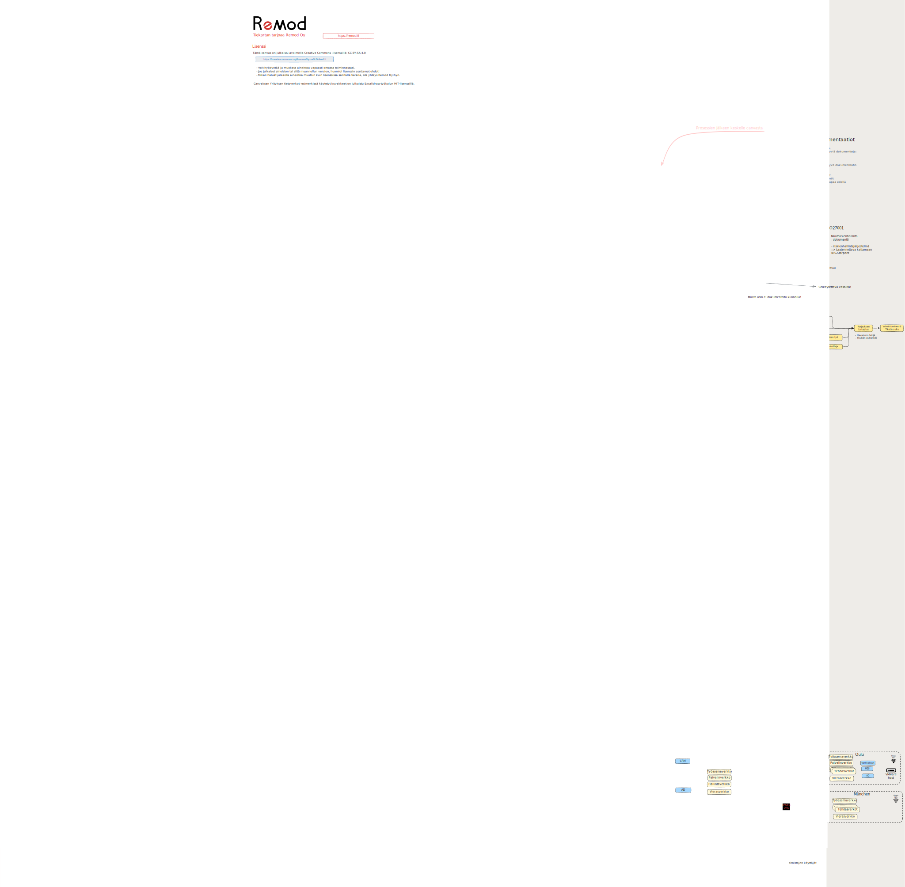

Dokumentin otsikot vastaavat taulun eri osioita. Materiaali on suunniteltu mahdollisimman hyvin eri alojen yrityksiä palvelevaksi, joten jo alkuvaiheessa kannattaa tunnistaa omalle toiminnalle mahdolliset epäoleelliset ja toisaalta oman toiminnan kannalta puuttuvat sisällöt. Esimerkkikaaviossa on käytetty lähtökohtana valmistavan teollisuuden yritystä - rakentakaa oma tiekarttanne itsenne näköiseksi.

Vaikka tässä on keskitytty NIS2-direktiivin tuomiin vaatimuksiin, materiaali on helposti sovellettavissa apuvälineeksi myös muiden samantyyppisten vaatimuskokonaisuuksien täyttämiseksi tehtävään työhön ja sitä voi käyttää myös välineenä oman organisaation toiminnan hahmottamiseen.

NIS2-vaatimusten täyttämisessä tärkeä väline on dokumentaatio ja sen ylläpitäminen ajantasaisena. Tässä rohkaisemme ensisijaisesti hyödyntämään olemassaolevia dokumentaatioita täydentäen niitä vaatimusten kannalta tarpeellisilla osilla. Tavoitteena tulisi olla aidosti yrityksen toiminnan turvallisuuden lisääminen ja liiketoiminnan ja strategisten tavoitteiden palveleminen.

Toimiva tapa aloittaa NIS2-työ on järjestää työpajoja, joissa yrityksen eri toimintojen edustajat tuovat pöytään käytännön kokemusta ja tietoa todellisista tarpeista ja toimintatavoista. Jos muutostöitä tehdään joka tapauksessa, ne kannattaa suunnitella siten että ne vastaavat myös liiketoiminnan muihin tarpeisiin.

Esimerkissämme on käytetty [Excalidraw-työkalua](https://excalidraw.com) sen joustavuuden ja helpon saatavuuden vuoksi. Usean käyttäjän yhtäaikaisen muokkausmahdollisuuden ansiosta taulun työstäminen onnistuu yhteistyössä myös etätapaamisessa. Voit myös vapaasti käyttää jotain muuta piirtotyökalua ja käyttää NIS2-tiekarttaa apuna ohjaamaan yritystoiminnan analysointia tarpeen mukaan.

**Huomaa että ilmaisversiota käytettäessä Excalidraw canvas täytyy tallentaa itse omalle koneelle talteen istuntojen välillä!**

## 1: Mitä on suojattava ydinliiketoiminta?

Vaikka muiden osioiden työstämisen järjestys on vapaampaa, aloitus ydinliiketoiminnan eri osioiden kuvaamisesta on perusta, jonka päälle loppuosa työtä rakennetaan. Aloita siis tästä!

Mitä yrityksesi konkreettisesti toimittaa asiakkailleen? Kuinka toimitettava tuote tai palvelu syntyy?

Ajattele erityisesti raaka-aineiden, tuotteiden ja liikevaihdon syntymistä yrityksessä. Tunnista ne liiketoiminnot sekä keskeiset liiketoimintaprosessit, joiden pysähtyminen pysäyttäisi myös yrityksen ensisijaisten tuotteiden tai palveluiden toimituksen asiakkaille.

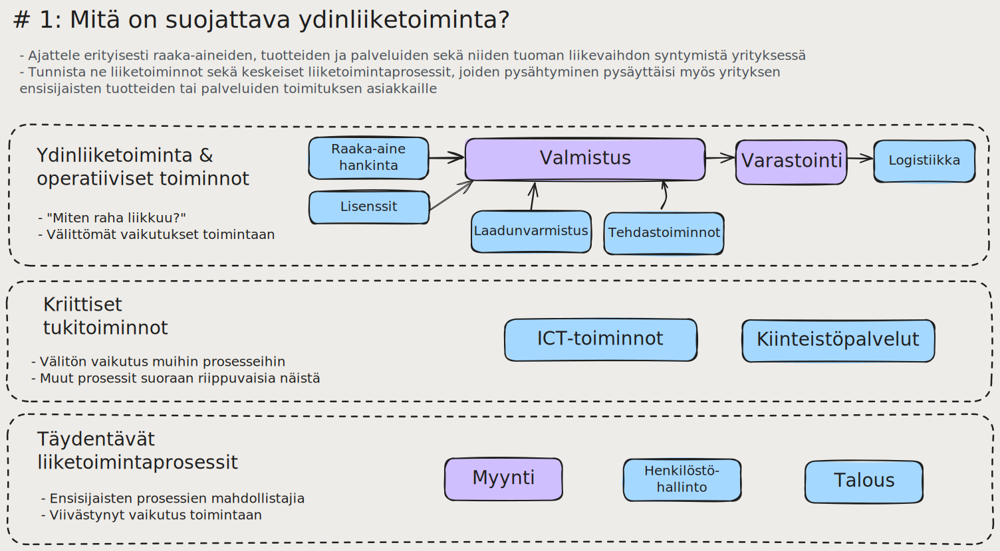

Ydinliiketoiminnalla ja kriittisillä toiminnoilla tarkoitamme tässä yhteydessä toimintoja, joiden häiriöillä on välitön vaikutus yrityksen toimintaan tai muihin prosesseihin ja joista muuta prosessit ovat suoraan riippuvaisia. Täydentäviksi katsotaan toiminnot, joiden häiriöiden vaikutus on viivästynyt, vaikka yritys ei sinänsä voisikaan toimia ilman kyseistä toimintoa.

Kuvatussa esimerkikssä myynti on täydentävä liiketoimintaprosessi koska kuviteltu yritys kykenee jatkmaan tuotantoa ja toimituksia olemassa olevaan tilauskantaan perustuen päiviä tai viikkoja, vaikka myynnin toiminnot estyisivät. Toisaalta esimerkiksi kuluttajamyyntiä tekevä verkkokauppa tai kivijalkamyymälä on paljon suoremmin riippuvainen varsinaisen myynti-prosessin ja siihen liittyvien järjestelmien toiminnasta. Tällöin Myynti olisi suoraan ydinliiketoimintaa ja esimerkiksi logistiikka voisi kestää toimialasta riippuen päivistä jopa viikkoihin kestävän katkon.

## 2: Toimipaikat

Hahmotelkaa yrityksen eri toimintojen fyysinen sijoittuminen. Täydentäkää toimintanne tarpeet huomioiden esimerkiksi toimipisteistä käytetyillä sisäisillä tunnisteilla, toimipisteen pääasiallisella roolilla tai tunnistetuilla erityispiirteillä.

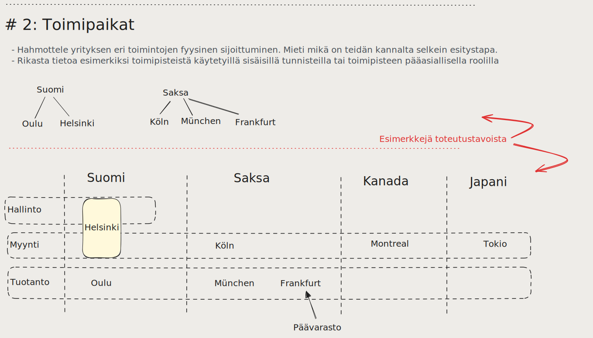

Mikäli toimipisteitä on paljon, voi tässä kohti kuvata esimerkiksi määriä eri maissa tai pyrkiä tunnistamaan poikkeavien tai liiketoiminnan kannalta erityisten toimintojen sijainteja. 

## 3: IT-järjestelmät, palvelut ja ohjelmistot

Luokaa mahdollisimman kattava lista liiketoiminnassanne käytetyistä järjestelmistä, teknologioista ja palveluista. Ryhmitelkää tunnistettuja kohteita tavalla, joka auttaa havainnollistamaan kokonaisuutta.

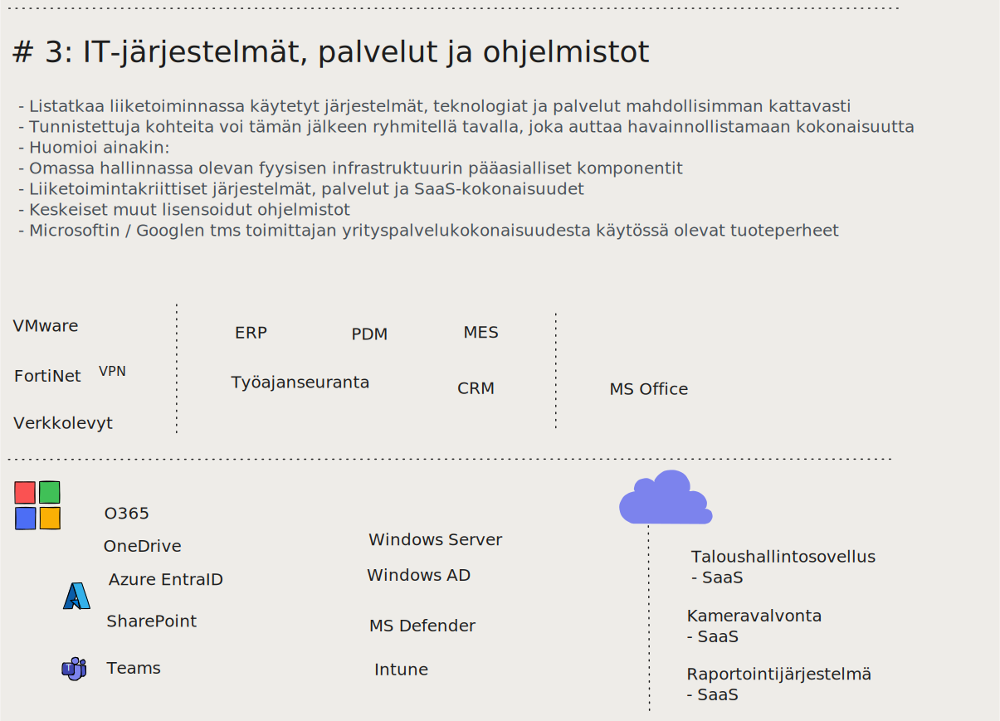

Huomioikaa erityisesti
- omassa hallinnassanne olevan fyysisen infrastruktuurin pääasialliset komponentit
- liiketoimintakriittiset järjestelmät, palvelut ja SaaS-kokonaisuudet
- keskeiset muut lisensoidut ohjelmistot
- Microsoftin, Googlen tms toimittajan yrityspalvelukokonaisuudesta käytössä olevat tuoteperheet
- Yritystoimintaa varten räätälöidyt järjestelmät

Toisin kuin esimerkissä (ERP, PDM, jne...), käytössä olevat järjestelmät kannattaa nimetä, jotta lukijalle on selvää mitä järjestelmää tarkoitetaan.

## 4: Yleisten ICT-palveluiden toimittajat

Listatkaa kumppanit, joilta hankitaan yleisiä IT-palveluita ja -tuotteita. Keskittykää tunnistamaan sellaiset käytössä olevat tuote- ja palvelukokonaisuudet, jotka eivät ole sidottuja yksittäiseen toimittajaan, vaan niitä voidaan hankkia ja kilpailuttaa useamman toimittajan välillä.

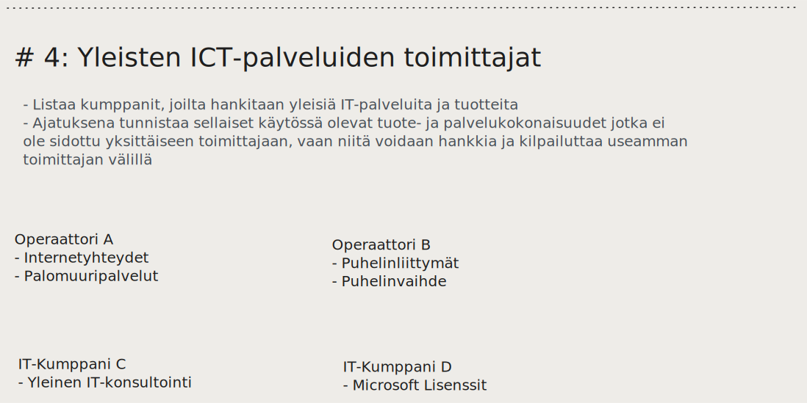

Tässä osiossa tunnistetut palvelut ovat sellaisia, joiden sisältöön, hintaan ja sopimusehtoihin on usein mahdollista vaikuttaa ja palvelun hankinnassa on syytä arvioida kuhunkin palveluun sisältyvät riskit sekä niiden tarvitsemat hallintakeinot.

## 5: Räätälöidyt järjestelmät ja toimittajat

Kopioi aiemmasta IT-järjestelmät ja palvelut -osiosta (#3) ne järjestelmät, jotka on tehty tai joita on merkittävästi räätälöity juuri teidän liiketoimintanne tarpeisiin. Tunnista ja liitä liiketoiminnan kannalta oleellisten räätälöityjen järjestelmien toimittajat kuhunkin järjestelmään.

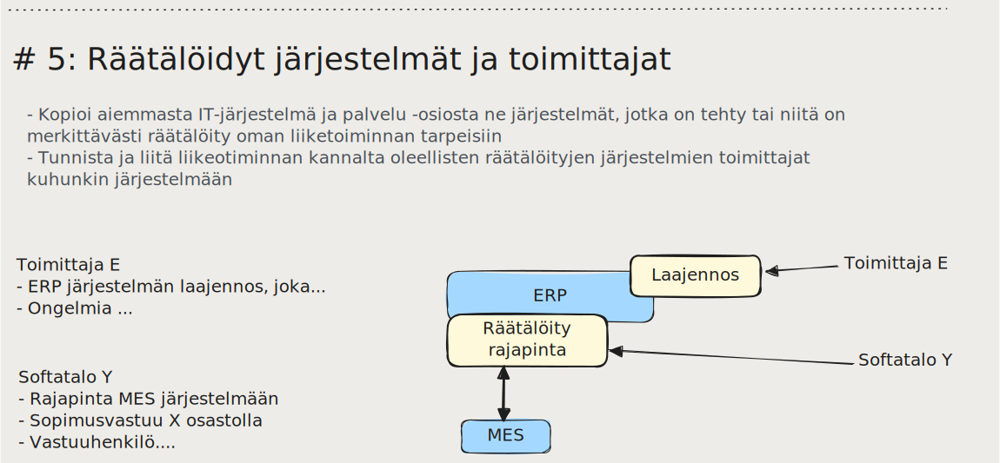

Tunnistakaa ja kirjatkaa esimerkiksi ongelmakohtia ja riskejä, nimeä vastuuhenkilöitä ja -rakenteita.

Usein räätälöityihin järjestelmiin liittyy riskejä ylläpidon ja jatkuvuuden suhteen. Miten toimitte esimerkiksi tilanteessa, jossa järjestelmän toimittajan oma toiminta loppuu, eikä sille enää saada turvallisuuspäivityksiä?

Mitä muita riskejä räätälöityjen järjestelmien elinkaaren hallintaan liittyy juuri teidän ympäristössänne?

## 6: Ulkoiset palvelut ja integraatiot toimitusketjussa

Listatkaa alihankkijoiden, yhteistyö- ja sopimuskumppaneiden järjestelmät ja palvelut huomioiden erityisesti sellaiset järjestelmät ja palvelut, joihin on olemassa joko järjestelmäintegraatio tai erillisiä käyttäjätunnuksia.

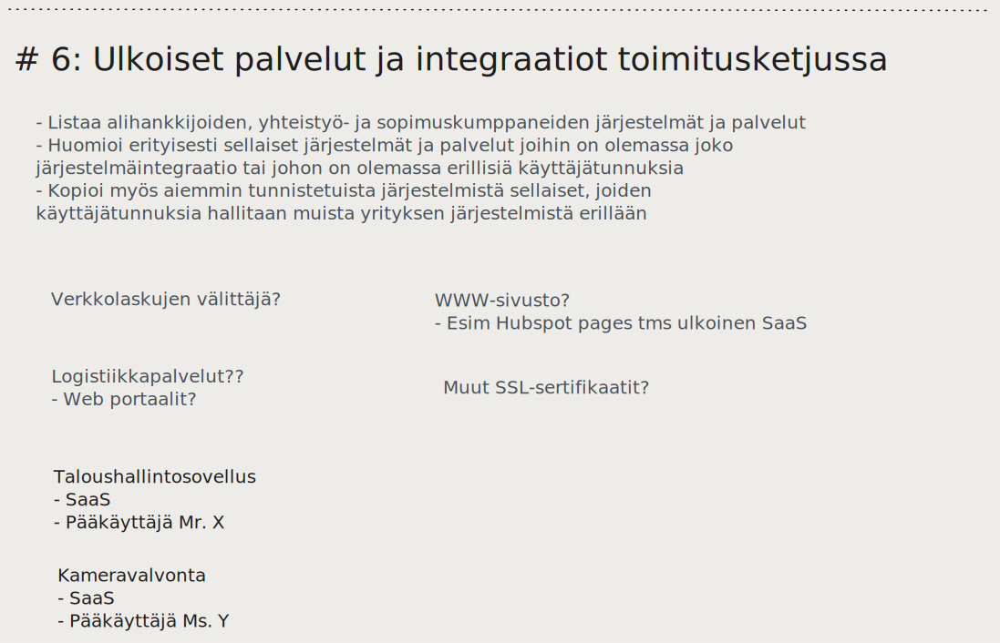

Kopioikaa tähän myös aiemmin tunnistetuista järjestelmistä sellaiset, joiden käyttäjätunnuksia hallitaan muista yrityksen järjestelmistä erillään.

Kuka hallinnoi tunnuksia? Onko yrityksessänne näkyvyys tunnusten ja pääsyjen ajantasaiseen tilanteeseen? Liittyykö johonkin kokonaisuuteen erityistä huomioitavaa?

Voit laajentaa kuvaa piirtämällä ulkoisten ja sisäisten järjestelmien väliset integraatiot.

## 7: ICT-järjestelmien käyttö liiketoiminnassa

Kopioi ydinliiketoimintaa kuvaavassa osuudessa #1 tunnistetut liiketoiminnot ja prosessit tähän osioon ja tarkenna tarvittaessa lisäämällä myös muita prosesseja. Kopioi IT-järjestelmiä kuvaavassa osuudessa #3 tunnistetut kokonaisuudet ja liitä ne osaksi liiketoimintoja, joissa kyseistä järjestelmää tai palvelua käytetään. Kuvaa lyhyesti kunkin järjestelmän käyttötapa ja merkitys kullekin liiketoiminnolle.

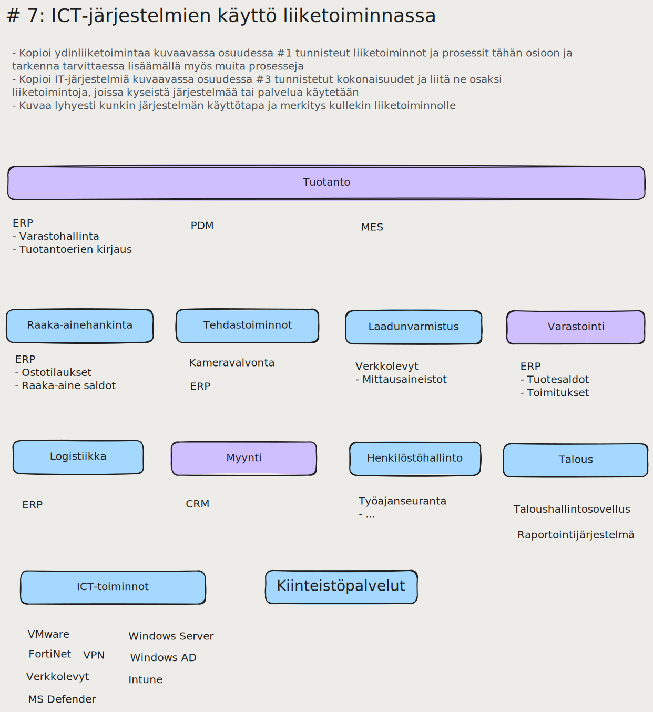

Voit värjätä punaiseksi sellaiset järjestelmät, jotka ovat kyseiselle liiketoiminnolle täysin välttämättömiä.

Tämän kuvan käyttäjälle olisi hyvä syntyä kuva siitä mitä järjestelmiä kussakin liiketoiminnossa käytetään sekä missä roolissa ne ovat.

## 8: Liiketoiminnan kannalta kriittiset prosessit ja dokumentaatiot

Liiketoiminnan prosessien nykytilaan on helpoin päästä kiinni tarkastelemalla yrityksen olemassaolevaa dokumentaatiota. Liikkelle voi lähteä esimerkiksi dokumentaation sisällysluetteloista, joiden perusteella saa nopeasti yleiskuvan dokumentaation laajuudesta ja kattavuudesta otsikkojen tasalla.

Otsikkotasolta olisi hyvä löytyä ainakin seuraavia kokonaisuuksia:

- IT-laitteiden, tyasemien, palvelinten ja ohjelmistojen kirjanpitoon liittyvä dokumentaatio
- Riskienhallintaan liittyvät dokumentit, suunnitelmat ja prosessikuvaukset
- Käyttäjätunnusten ja pääsynhallintaan liittyvä dokumentaatio ja prosessit
- Toimintaympäristön ja IT-järjestelmien toiminnan valvontaan ja poikkeamien havainnointiin liittyvä dokumentaatio
- Palautumissuunnitelmat, kuvaukset varmistuksista ja Disaster Recovery - käytännöistä
- Toimitusketjun hallintaan sekä IT-toimittajiin liittyvät dokumentit
- Henkilöstöhallintaan liittyvä dokumentaatio esim: Perehdyttäminen, koulutukset, roolit ja vastuut
- Muut yrityksen toiminnan kannalta keskeiset IT-arkkitehtuuria ja strategiaa käsittelevät dokumentit

Tunnista yhdessä eri liketoimintojen kanssa sellaiset käytännöt ja prosessit, jotka liittyy jollain tapaa edellämainittuihin kokonaisuuksiin, mutta joita ei välttämättä ole dokumentoitu

- Lisãä myös tunnistetut dokumentoimattomat prosessit ja käytännöt taululle

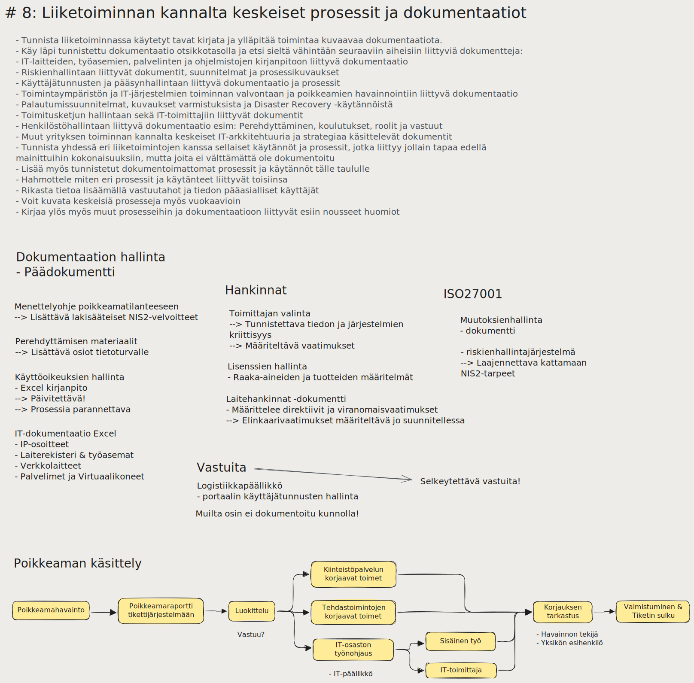

Miten eri prosessit ja käytänteet liittyvät toisiinsa?

- Rikasta tietoa lisäämällä vastuutahot ja tiedon pääasialliset käyttäjät
- Voit kuvata keskeisiä prosesseja myös vuokaavioin
- Kirjaa ylös myös muut prosesseihin ja dokumentaatioon liittyvät esiin nousseet huomiot

Mihin dokumentaatio on tallennettu? Kuka sitä ylläpitää? Kuinka olemassaolevan dokumentaation ajantasaisuudesta huolehditaan?

Liittyykö jotkin aiemmin tunnistetuista järjestelmistä liiketoiminnan kannalta keskeisiin prosesseihin?

## 9: Liiketoimintakriittiset tietosisällöt, järjestelmät ja riippuvuudet

Kohdassa #3 on tunnistettu yrityksen käytössä olevat järjestelmät, kohdassa #7 on kuvattu kuinka kutakin järjestelmää käytetään eri liiketoiminnoissa. Lisäksi kohdassa #8 on tunnistettu toiminnan kannalta keskeisiä hallinnollisia prosesseja ja niiden dokumentaatiota.

Tässä kohdassa on tarkoitus luoda kartta yrityksen järjestelmistä ja muodostaa ymmärrys siitä, mitä tietoaineistoja järjestelmiin on tallennettu ja toisaalta miten järjestelmiin tallennettua tietoa käytetään ristiin eri järjestelmien välillä.

Tilanteesta riippuen analyysiä voi olla helppo lähteä toteuttamaan joko tunnistamalla ensin liiketoiminnan kannalta oleellisia tietoaineistoja tai tuomalla taululle ensin kohdassa #3 tunnistettuja järjestelmiä ja analysoimalla mitä tietoaineistoja ne pitävät sisällään.

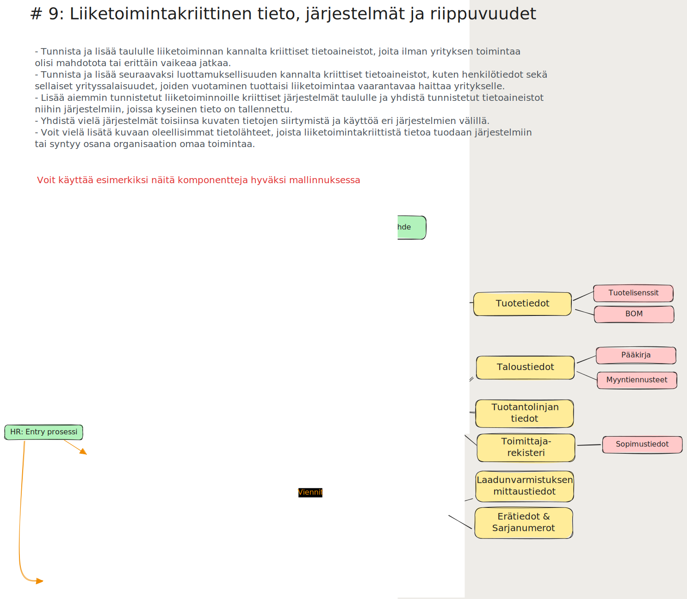

Tunnista ja lisää taululle 
- liiketoiminnan kannalta kriittiset tietoaineistot, joita ilman yrityksen toimintaa olisi mahdotonta tai erittäin vaikeaa jatkaa
- luottamuksellisuuden kannalta kriittiset tietoaineistot, kuten henkilötiedot sekä sellaiset yrityssalaisuudet, joiden vuotaminen tuottaisi liiketoimintaa vaarantavaa haittaa yritykselle

Lisää taululle myös aiemmin tunnistetut liiketoiminnoille kriittiset järjestelmät ja yhdistä tunnistetut tietoaineistot niihin järjestelmiin, joissa kyseinen tieto on tallennettu. Yhdistä sitten järjestelmät toisiinsa kuvaten tietojen siirtymistä ja käyttöä eri järjestelmien välillä. Voit lisätä kuvaan myös oleellisimamt tietolähteet, joista liiketoimintakriittistä tietoa tuodaan järjestelmiin tai sitä syntyy osana organisaation omaa toimintaa.

## 10: Muita toimintaa hahmottavia kuvia

Mikäli yrityksen liiketoiminnassa on muita erityisen isossa roolissa olevia elementtejä, joiden huomioiminen on oleellista riskienhallinnan ja toimenpiteiden suunnittelun kannalta, tee niistä omat osiot osaksi canvasta. Pyri tunnistamaan erityisesti  sellaisia komponentteja ja kokonaisuuksia, jotka vaativat erityistä huomiota joko tekniseltä tai hallinnolliselta kannalta.

Esimerkkejä

- Yrityksen liiketoiminnan kannalta kriittisess roolissa oleva verkkoympäristö
- Monimutkaisemmat alihankintaketjut, joissa tapahtuvat häiriöt vaativat varautumista
- Monimutkaisemmat yksittäisten järjestelmien integratiot mikäli niistä ei ole valmista dokumentaatiota ja ne ovat erityisen kriittisessä roolissa liiketoiminnan kannalta
- Mitä hyvänsä muuta, mitä nousi esiin canvasta tystäess, mutta ei sopinut ennalta mietittyihin kohtiin ja raameihin! Laajenna vapaasti!

### Tietoverkot – Esimerkki

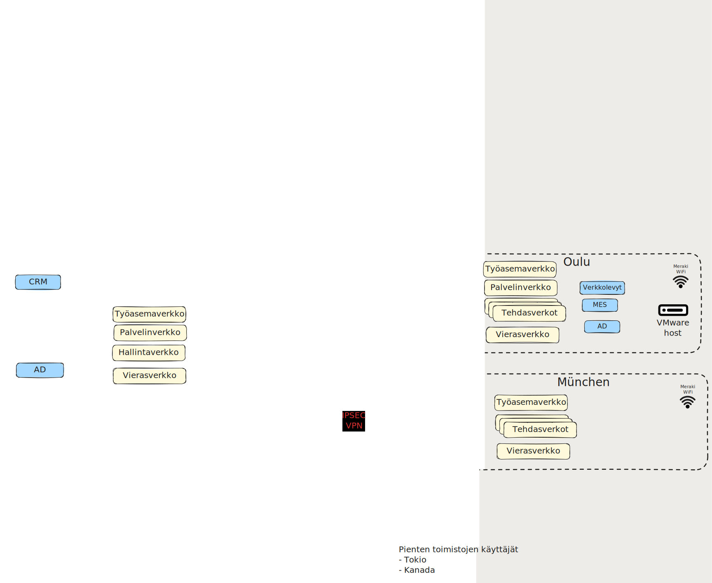
